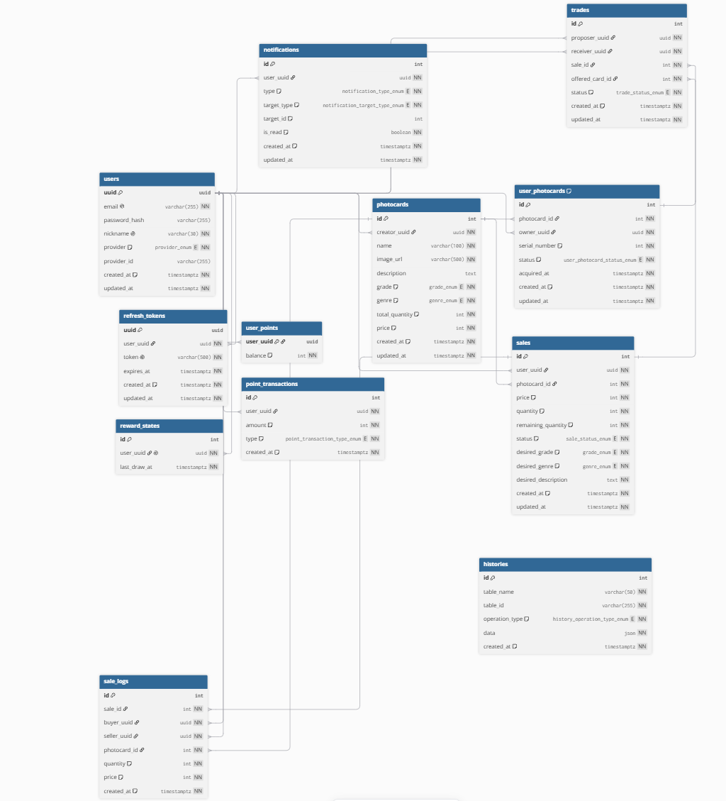
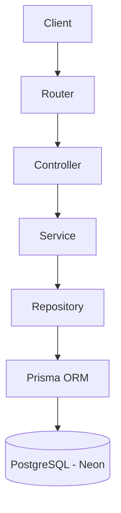

# 📸 최애의 포토 (Favorite Photo)

> 사용자가 직접 포토카드를 생성하고 수집하며, 판매 및 교환을 통해 다른 사용자와 거래할 수 있는 포토카드 마켓플레이스 서비스


---

# 📚 목차

- [👥 팀원 구성](#-팀원-구성)
- [📂 Repository](#-repository)
- [🚀 배포 주소](#-배포-주소)
- [📖 프로젝트 소개](#-프로젝트-소개)
- [🛠 기술 스택](#-기술-스택)
- [✨ 주요 기능](#-주요-기능)
- [🏗 시스템 아키텍처](#-시스템-아키텍처)
- [👨‍💻 팀원별 구현 기능](#-팀원별-구현-기능)
- [🚨 주요 트러블 슈팅](#-주요-트러블-슈팅)
- [📎 주요 PR](#-주요-pr)
- [🤝 협업 방식](#-협업-방식)
- [🧹 코드 품질 관리](#-코드-품질-관리)
- [🔮 향후 개선 사항](#-향후-개선-사항)

---

# 👥 팀원 구성

## Backend

| 이름   | 역할                |
| ------ | ------------------- |
| 장민주 | Backend Part Leader |
| 추명곤 | Backend Developer   |

## Frontend

| 이름    | 역할                 |
| ------- | -------------------- |
| 한고은  | Team Leader          |
| 유서현  | Frontend Part Leader |
| 김상우A | Frontend Developer   |

---

# 📂 Repository

### Frontend

- https://github.com/12-sprint-part3-project/12-myfavoritephoto-3nergy-FE

### Backend

- https://github.com/12-sprint-part3-project/12-myfavoritephoto-3nergy-BE

---

# 🚀 배포 주소

### Frontend

- https://favorite-photo-3nergy.vercel.app

### Backend

- https://one2-myfavoritephoto-3nergy-be.onrender.com

### Swagger

- https://one2-myfavoritephoto-3nergy-be.onrender.com/api-docs

---

# 📖 프로젝트 소개

최애의 포토는 사용자가 직접 포토카드를 생성하고 수집하며, 판매 및 교환을 통해 다른 사용자와 거래할 수 있는 포토카드 거래 플랫폼입니다.

사용자는 원하는 포토카드를 구매하거나 교환 제안을 보낼 수 있으며, 실시간 알림을 통해 거래 진행 상황을 즉시 확인할 수 있습니다.

또한 Google OAuth 로그인과 JWT 기반 인증을 적용하여 사용자 인증을 안전하게 처리하였으며, PostgreSQL Trigger 기반 History Audit Log를 통해 주요 데이터 변경 이력을 추적할 수 있도록 구현했습니다.

### 📅 프로젝트 기간

- 2026.06.01 ~ 2026.06.23

---

# 🛠 기술 스택

| Category       | Stack                    |
| -------------- | ------------------------ |
| Backend        | Node.js, Express.js      |
| ORM            | Prisma ORM               |
| Database       | PostgreSQL (Neon)        |
| Authentication | JWT, Google OAuth 2.0    |
| Realtime       | SSE (Server-Sent Events) |
| Validation     | Zod                      |
| DevOps         | Render, Neon             |
| Collaboration  | GitHub, Discord, Notion  |
| Code Quality   | ESLint                   |

---

# 🗄 ERD

<p align="center">
  
</p>

# 🔗 상세 ERD 보기

https://dbdiagram.io/d/3NERGY-6a1d1ddef15b4b045241aa29

---

<br/>

# 핵심 설계 포인트

- User를 중심으로 인증, 포인트, 알림 시스템을 구성
- Photocard → UserPhotocard → Sale → Trade 흐름으로 거래 구조 설계
- PostgreSQL Trigger 기반 History Audit Log를 통해 주요 데이터 변경 이력 관리
- Notification + SSE를 활용한 실시간 거래 알림 제공

<br/>

# ✨ 주요 기능

## 🔐 인증 시스템

### JWT 인증

- 회원가입
- 로그인
- 로그아웃
- Access Token 재발급
- JWT 인증 미들웨어

### Refresh Token 관리

- Refresh Token DB 저장
- Refresh Token Rotation 적용
- 토큰 만료 검증
- Refresh Token 자동 정리

### Google OAuth

- Google OAuth 로그인
- OAuth Redirect Flow 적용
- BFF 구조 적용
- Cross Domain Cookie 문제 해결

---

## 💰 포인트 시스템

### 이벤트 포인트

- 이벤트 포인트 지급
- 지급 이력 관리
- 참여 시간 제한

### 사용자 포인트

- 내 포인트 조회
- 회원가입 보너스 5000 포인트 지급

### 데이터 정합성

- Transaction 기반 처리
- 동시성 문제(Race Condition) 방지

---

## 🖼 포토카드 시스템

### 포토카드 생성

- 포토카드 생성 API
- 월별 생성 제한
- 발행 수량 관리

### UserPhotocard 관리

- 포토카드 생성 시 자동 발급
- 보유 수량 관리
- 소유 상태 관리

---

## 🛒 거래 시스템

### 판매

- 판매 등록
- 판매 수정
- 판매 중단

### 구매

- 포토카드 구매
- 포인트 차감 및 적립
- 거래 이력 생성

### 교환

- 교환 제안
- 교환 수락
- 교환 거절
- 교환 자동 취소 처리

---

## 🔔 실시간 알림 시스템

### SSE 기반 알림

- 실시간 알림 전송
- 알림 조회
- 알림 읽음 처리

### 지원 이벤트

- TRADE_PROPOSED
- TRADE_ACCEPTED
- TRADE_REJECTED
- TRADE_CANCELED
- TRADE_CANCELED_BY_SOLD_OUT
- SALE_UPDATED
- SALE_STOPPED
- PURCHASE_COMPLETED
- SALE_COMPLETED
- SOLD_OUT

---

## 📜 History Audit Log

### PostgreSQL Trigger 기반 Audit Log

- CREATE 기록
- UPDATE 기록
- DELETE 기록

### 감사 로그 기능

- before / after 데이터 저장
- DB 직접 수정 추적
- Bulk 작업 추적
- 변경 이력 관리

---

## ⚙️ 운영 자동화

### Node-cron

- 만료 Refresh Token 자동 삭제
- 운영 데이터 관리 자동화

### 향후 확장

- 오래된 Notification 정리
- 오래된 History Audit Log 정리

<br/>
<br/>

# 🏗 시스템 아키텍처



---

<br/>
<br/>

# 👨‍💻 팀원별 구현 기능

<details>
<summary><strong>장민주 - Backend Part Leader</strong></summary>

<br />

## 🔐 인증 시스템

- 회원가입 API 구현
- 로그인 API 구현
- 로그아웃 API 구현
- Access Token 재발급 API 구현
- JWT 인증 미들웨어 구현
- Refresh Token DB 저장 및 관리
- Refresh Token Rotation 적용

### 주요 구현 내용

- Access Token / Refresh Token 분리
- Refresh Token DB 저장 구조 설계
- Refresh Token 검증 및 재발급 로직 구현
- 로그아웃 시 Refresh Token 삭제 처리
- JWT 기반 인증 미들웨어 구현

<br />

## 🔑 Google OAuth

- Google OAuth 로그인 구현
- OAuth Redirect Flow 적용
- BFF 구조 설계 및 적용
- Cross Domain Cookie 문제 해결

### 주요 구현 내용

- Google OAuth Authorization Code Flow 적용
- Refresh Token HttpOnly Cookie 저장
- Frontend Route Handler 기반 BFF 구조 도입
- Third-Party Cookie 이슈 해결
- OAuth 로그인과 일반 로그인 인증 구조 통일

<br />

## 💰 포인트 시스템

- 내 포인트 조회 API 구현
- 이벤트 포인트 지급 API 구현
- 회원가입 시 기본 포인트 지급 기능 구현
- 이벤트 포인트 동시성 개선

### 주요 구현 내용

- 회원가입 시 5000 포인트 지급
- RewardState 기반 이벤트 참여 제한
- 이벤트 포인트 지급 이력 관리
- Race Condition 방지
- Service Layer 기반 Transaction 적용

<br />

## 🖼 포토카드 시스템

- 포토카드 생성 API 구현
- UserPhotocard 자동 생성 기능 구현
- 월별 생성 제한 기능 구현

### 주요 구현 내용

- 포토카드 생성 시 발행 수량만큼 UserPhotocard 생성
- 월별 생성 제한 정책 적용
- 포토카드 생성 트랜잭션 처리
- 보유 수량 관리 기능 구현

<br />

## 🔄 트랜잭션 처리

### 회원가입

다음 작업을 하나의 Transaction으로 처리했습니다.

- User 생성
- UserPoint 생성
- RewardState 생성
- 가입 보너스 5000 포인트 지급

### 포토카드 생성

다음 작업을 하나의 Transaction으로 처리했습니다.

- Photocard 생성
- UserPhotocard 생성

### 이벤트 포인트 지급

다음 작업을 하나의 Transaction으로 처리했습니다.

- 포인트 지급
- 포인트 이력 생성
- RewardState 갱신

<br />

## 🔔 실시간 알림 시스템

- SSE 기반 실시간 알림 구현
- 알림 조회 API 구현
- 알림 읽음 처리 API 구현
- 거래 이벤트 알림 연동

### 주요 구현 내용

- SSE 연결 관리
- Heartbeat 이벤트 추가
- Fetch Stream 기반 SSE 구현
- 거래 이벤트 발생 시 실시간 알림 전송
- 알림 저장 및 조회 기능 구현

<br />

## 📜 History Audit Log

- PostgreSQL Trigger 기반 Audit Log 구축
- DB 직접 수정 이력 추적
- Bulk 작업 이력 추적

### 주요 구현 내용

- CREATE / UPDATE / DELETE 자동 기록
- before / after 데이터 저장
- DBMS 레벨 감사 로그 구현
- Prisma Extension 제거
- DBeaver, Prisma Studio 직접 수정 추적 가능

<br />

## ⚙️ 운영 자동화

- Node-cron 기반 Refresh Token 자동 정리

### 주요 구현 내용

- 만료 Refresh Token 자동 삭제
- 새벽 배치 작업 수행
- 운영 데이터 관리 자동화

<br />

## 🤝 협업 및 개발 환경

- GitHub Repository 초기 구성
- 브랜치 전략 수립
- PR Template 작성
- Issue Template 작성
- Branch Protection Rule 적용
- ESLint 적용
- Render 배포 환경 구축

### 주요 기여

- Git Flow 기반 협업 프로세스 설계
- 코드 리뷰 문화 정착
- 브랜치 보호 정책 적용
- 자동 배포 환경 구축
- 백엔드 파트 리딩

</details>

<br />

<details>
<summary><strong>추명곤 - Backend Developer</strong></summary>

<br />

## 🛒 거래 시스템

### 마켓플레이스

- 판매 포토카드 목록 조회 API 구현
- 판매 포토카드 상세 조회 API 구현
- 나의 판매 포토카드 조회 API 구현
- 판매 상태별 및 거래 방식별 집계 기능 구현

### 판매

- 판매 등록 API 구현
- 판매 수정 API 구현
- 판매 중단 API 구현

### 구매

- 포토카드 구매 API 구현
- 포인트 차감 및 판매자 포인트 적립 처리
- 구매 이력(SaleLog) 생성

### 교환

- 판매글 내 교환 제안 목록 조회 API 구현
- 교환 제안 API 구현
- 교환 수락 API 구현
- 교환 거절 API 구현
- 교환 취소 API 구현

### 마이 갤러리

- 보유 포토카드 목록 조회 API 구현
- 등급 및 장르별 필터 수량 집계 기능 구현

<br />

## ⚡ 성능 개선

목록 조회 API에서 중복 연산을 제거하여 응답 속도를 개선했습니다.

### 주요 개선 내용

- 공통 집계 유틸 함수 분리
- 필요한 컬럼만 조회하도록 select 최적화
- 응답 데이터 가공 로직 개선

### 개선 결과

- 응답 속도 6~9초 → 2~4초 개선

<br />

## 🔒 동시성 및 데이터 정합성 개선

구매 API에서 Race Condition을 해결하기 위해 조건부 차감 방식을 적용했습니다.

### 주요 구현 내용

- 수량 검증 로직 제거
- 조건부 차감 방식 적용
- 원자적 처리 보장
- 재고 부족 예외 처리

<br />

## 🏗️ 아키텍처 개선

멘토링 피드백을 반영하여 Service 계층에서 트랜잭션을 관리하도록 리팩토링했습니다.

### 주요 개선 내용

- Repository 단건 책임 분리
- Service 계층 중심 트랜잭션 관리
- # 계층별 역할 명확화

### 구매 기능

- 포토카드 구매 기능 구현
- 구매 이력 관리
- 포인트 차감 및 적립 처리

### 교환 기능

- 교환 제안 기능 구현
- 교환 수락 기능 구현
- 교환 거절 기능 구현

<br />

## 🔄 거래 데이터 처리

### 비즈니스 로직

- 판매 상태 관리
- 구매 처리 로직 구현
- 교환 처리 로직 구현

### 데이터 정합성

- 거래 데이터 일관성 관리
- 트랜잭션 기반 데이터 처리

### 거래 상태 관리

- ON_SALE 상태 관리
- TRADE_PENDING 상태 관리

<br />

## 📢 알림 시스템 연동

- 거래 관련 알림 연동
- 판매 상태 변경 알림 연동
- 교환 상태 변경 알림 연동

<br />

## 🏗 아키텍처 및 설계

- 거래 도메인 설계
- 판매/구매 구조 설계
- 교환 시스템 설계

<br />

## ⚡ 성능 개선 및 최적화

- 거래 데이터 조회 최적화
- 거래 처리 성능 개선

</details>

<br />
<br />
<br />

# 🚨 주요 트러블 슈팅

<details>
<summary><strong>1. Google OAuth 로그인 구조 개선 및 BFF 도입</strong></summary>

<br />

## 문제 상황

초기에는 OAuth 인증 완료 후 Access Token을 응답으로 반환하는 구조를 사용했습니다.

이후 사용자 경험 개선을 위해 Refresh Token을 HttpOnly Cookie에 저장하고 Frontend로 Redirect하는 방식으로 변경했지만, 배포 환경(Vercel + Render)에서는 브라우저의 Third-Party Cookie 정책으로 인해 Refresh Token 쿠키가 저장되지 않는 문제가 발생했습니다.

---

## 원인

```text
Frontend (vercel.app)
        ↓
Backend (onrender.com)
        ↓
Set-Cookie
        ↓
Third-Party Cookie 차단
```

브라우저가 서로 다른 도메인 간 쿠키 저장을 제한하고 있었습니다.

---

## 해결 방법

BFF(Backend For Frontend) 구조를 도입하여 인증 흐름을 변경했습니다.

```text
Google Login
↓
Frontend Callback
↓
Backend 인증 처리
↓
Refresh Token 저장
↓
Access Token 재발급
```

---

## 결과

- OAuth 로그인 안정성 향상
- Third-Party Cookie 문제 해결
- 로그인 상태 유지 가능
- 인증 구조 일관성 확보

</details>

---

<details>
<summary><strong>2. PostgreSQL Trigger 기반 History Audit Log 시스템 구축</strong></summary>

<br />

## 문제 상황

초기에는 Prisma Client Extension을 활용하여 History를 기록했습니다.

하지만 운영 환경에서는 DBeaver, Prisma Studio, SQL Editor 등을 통해 DB를 직접 수정할 수 있으며, 이러한 변경은 Prisma를 거치지 않기 때문에 이력이 기록되지 않는 문제가 있었습니다.

또한 Bulk 작업(createMany, updateMany, deleteMany)에 대한 추적도 제한적이었습니다.

---

## 기존 구조

```text
API
↓
Prisma Extension
↓
History
```

---

## 개선 구조

```text
데이터 변경
↓
PostgreSQL Trigger
↓
History
```

---

## 해결 방법

- PostgreSQL Trigger 함수 작성
- 범용 Trigger 함수 설계
- User, UserPoint, Sale, Trade, Notification 등에 적용
- Prisma Extension 제거

---

## 결과

- DB 직접 수정 추적 가능
- Bulk 작업 추적 가능
- 감사 로그 신뢰성 향상
- 운영 환경 대응력 향상

</details>

---

<details>
<summary><strong>3. JWT 인증 환경에서의 SSE 구현</strong></summary>

<br />

## 문제 상황

실시간 알림 기능 구현을 위해 SSE(Server-Sent Events)를 도입했습니다.

하지만 현재 인증 방식은 Authorization Header가 필요한 JWT 기반 인증 구조였으며, 브라우저 기본 EventSource는 Authorization Header를 지원하지 않았습니다.

---

## 문제 구조

```text
JWT 인증
↓
Authorization Header 필요
↓
EventSource 사용 불가
```

---

## 해결 방법

EventSource 대신 Fetch Stream 기반 SSE 연결 방식을 적용했습니다.

```text
Fetch
↓
Authorization Header 전달
↓
SSE 연결
↓
실시간 알림 수신
```

추가로 Heartbeat 이벤트를 구현하여 장시간 연결이 끊어지지 않도록 개선했습니다.

---

## 결과

- JWT 인증 유지
- 실시간 알림 기능 구현
- 브라우저 API 제약 해결
- 안정적인 SSE 연결 유지

</details>

---

<details>
<summary><strong>4. 이벤트 포인트 동시성 문제 해결</strong></summary>

<br />

## 문제 상황

이벤트 포인트 지급 기능에서 동시에 여러 요청이 발생할 경우 포인트가 중복 지급될 가능성이 존재했습니다.

예시

```text
사용자 요청 A
사용자 요청 B

동시에 실행

→ 둘 다 지급 성공
```

---

## 해결 방법

포인트 지급, 포인트 이력 생성, RewardState 갱신을 하나의 Transaction으로 처리하도록 개선했습니다.

또한 Repository가 아닌 Service 계층에서 Transaction을 관리하도록 구조를 변경했습니다.

```text
Service
↓
Transaction
 ├─ 포인트 지급
 ├─ 포인트 이력 생성
 └─ RewardState 갱신
```

---

## 결과

- 포인트 중복 지급 방지
- 데이터 정합성 확보
- 계층별 책임 분리
- 유지보수성 향상

</details>

---

<details>

<summary><strong>5. 구매 API Race Condition 해결</strong></summary>

<br />

## 문제 상황

초기 구매 로직은 판매글 조회 → 수량 검증 → 수량 차감 순서로 동작했습니다.

하지만 동시에 여러 사용자가 구매 요청을 보내는 경우, 서로 같은 재고를 조회한 뒤 모두 검증을 통과하여 재고가 음수가 되는 문제가 발생할 수 있었습니다.

### 기존 구조

```text
판매글 조회

↓

남은 수량 검증

↓

수량 차감
```

---

## 해결 방법

수량 검증 단계를 제거하고 조건부 차감 방식을 적용했습니다.

### 개선 구조

```text
판매 수량 차감

↓

차감 성공 → 구매 진행

↓

차감 실패 → 재고 부족 에러 반환
```

남은 수량 검증 자체를 수량 차감 과정에 포함하여 원자적으로 처리했습니다.

---

## 결과

- 동시 구매 상황에서도 데이터 정합성 유지
- Race Condition 해결
- 재고 음수 문제 방지
- 구매 안정성 향상

</details>

<br/>
<br/>
<br/>

# 📎 주요 PR

## 👨‍💻 장민주

### 🔐 JWT 인증 및 Refresh Token Rotation

**PR:**

- [#16 인증 시스템 구축](https://github.com/12-sprint-part3-project/12-myfavoritephoto-3nergy-BE/pull/16)

주요 내용

- JWT 기반 인증 구조 구축
- Refresh Token DB 저장
- Refresh Token 재발급 API 구현
- 로그아웃 기능 구현
- Refresh Token Rotation 적용

성과

- 토큰 재사용 공격 위험 감소
- 서버 측 토큰 관리 가능
- 인증 보안성 향상

---

### 🔑 Google OAuth 로그인 구조 개선 및 BFF 도입

**PR:**

- [#81 Google OAuth 로그인 구조 개선](https://github.com/12-sprint-part3-project/12-myfavoritephoto-3nergy-BE/pull/81)

주요 내용

- Google OAuth 로그인 구현
- OAuth Redirect Flow 개선
- BFF 구조 도입
- Cross Domain Cookie 문제 해결

성과

- 로그인 상태 유지 문제 해결
- OAuth 인증 안정성 향상
- 인증 구조 일관성 확보

---

### 📜 PostgreSQL Trigger 기반 History Audit Log

**PR:**

- [#72 History Audit Log 구축](https://github.com/12-sprint-part3-project/12-myfavoritephoto-3nergy-BE/pull/72)

주요 내용

- Prisma Extension 제거
- PostgreSQL Trigger 기반 감사 로그 구축
- DB 직접 수정 추적 지원
- Bulk 작업 추적 지원

성과

- 운영 환경 대응력 향상
- 감사 로그 신뢰성 확보
- 변경 이력 관리 체계 구축

---

### 💰 이벤트 포인트 동시성 개선

**PR:**

- [#97 이벤트 포인트 시스템 개선](https://github.com/12-sprint-part3-project/12-myfavoritephoto-3nergy-BE/pull/97)

주요 내용

- 이벤트 포인트 지급 로직 개선
- Race Condition 대응
- Service Layer 기반 Transaction 적용
- Repository 책임 분리

성과

- 포인트 중복 지급 방지
- 데이터 정합성 확보
- 유지보수성 향상

---

## 👨‍💻 추명곤

### 🛒 마켓플레이스 시스템 구축

**PR:**

- [#13 판매 포토카드 목록 조회](https://github.com/12-sprint-part3-project/12-myfavoritephoto-3nergy-BE/pull/13)
- [#23 판매 포토카드 상세 조회](https://github.com/12-sprint-part3-project/12-myfavoritephoto-3nergy-BE/pull/23)
- [#29 나의 판매 포토카드 조회](https://github.com/12-sprint-part3-project/12-myfavoritephoto-3nergy-BE/pull/29)
- [#39 판매 등록](https://github.com/12-sprint-part3-project/12-myfavoritephoto-3nergy-BE/pull/39)
- [#43 판매 수정](https://github.com/12-sprint-part3-project/12-myfavoritephoto-3nergy-BE/pull/43)
- [#49 판매 중단](https://github.com/12-sprint-part3-project/12-myfavoritephoto-3nergy-BE/pull/49)

주요 내용

- 판매 포토카드 목록 및 상세 조회 구현
- 나의 판매 포토카드 조회 구현
- 판매 등록, 수정, 중단 기능 구현
- 페이지네이션, 필터 및 검색 기능 적용

성과

- 포토카드 거래의 핵심 판매 기능 구축
- 사용자 탐색 경험 개선
- 판매 상태 및 데이터 정합성 확보

---

### 💳 구매 기능 구현 및 동시성 개선

**PR:**

- [#52 구매 API 구현](https://github.com/12-sprint-part3-project/12-myfavoritephoto-3nergy-BE/pull/52)

주요 내용

- 포토카드 구매 API 구현
- 구매자 포인트 차감 및 판매자 포인트 적립 처리
- 구매 이력 생성
- 판매 수량 차감 및 품절 상태 자동 변경
- 조건부 차감 방식 적용

성과

- 포인트 기반 구매 프로세스 구축
- Race Condition으로 인한 재고 정합성 문제 해결
- 동시 구매 상황에서도 안전한 거래 처리 가능

---

### 🔄 교환 시스템 구축

**PR:**

- [#54 교환 조회 및 제안 기능 구현](https://github.com/12-sprint-part3-project/12-myfavoritephoto-3nergy-BE/pull/54)
- [#60 교환 수락, 거절, 취소 기능 구현](https://github.com/12-sprint-part3-project/12-myfavoritephoto-3nergy-BE/pull/60)

주요 내용

- 판매글별 교환 제안 목록 조회 API 구현
- 교환 제안 API 구현
- 교환 수락 / 거절 / 취소 API 구현
- 교환 상태 관리
- 교환 완료 시 카드 소유권 이전 처리
- 품절 시 대기 중인 교환 제안 자동 취소 처리

성과

- 판매 외 교환 거래 방식 제공
- 교환 제안부터 완료까지의 거래 흐름 구축
- 카드 상태 및 소유권 정합성 확보

---

### ⚡ 목록 조회 성능 개선

**PR:**

- [#77 목록 조회 성능 개선](https://github.com/12-sprint-part3-project/12-myfavoritephoto-3nergy-BE/pull/77)

주요 내용

- 목록 조회 응답 데이터 가공 로직 개선
- 필터별 수량 집계 로직 공통화
- 필요한 데이터만 조회하도록 Select 최적화
- 중복 연산 제거

성과

- 응답 속도 6~9초 → 2~4초로 약 50% 이상 단축
- 중복 연산 제거를 통한 목록 조회 성능 향상
- 공통 집계 로직 분리로 유지보수성 개선
  **PR:** (예시)
  https://github.com/12-sprint-part3-project/12-myfavoritephoto-3nergy-BE/pull/16

주요 내용

- JWT 기반 인증 구조 구축
- Refresh Token DB 저장
- Refresh Token 재발급 API 구현
- 로그아웃 기능 구현
- Refresh Token Rotation 적용

성과

- 토큰 재사용 공격 위험 감소
- 서버 측 토큰 관리 가능
- 인증 보안성 향상

---

<br/>
<br/>
<br/>

# 🤝 협업 방식

## Git Flow 전략

프로젝트는 Git Flow 기반 브랜치 전략을 사용하여 협업을 진행했습니다.

### 브랜치 구조

```text
main
 └─ dev
      └─ feat/{issue-number}-{feature-name}
```

예시

```text
feat/16-jwt-auth
feat/62-notification-system
feat/72-history-audit-log
feat/81-google-oauth-bff
feat/97-event-point-reward
feat/101-user-signup-policy
```

### 협업 프로세스

```text
Issue 생성
↓
Feature Branch 생성
↓
기능 개발
↓
Pull Request 생성
↓
Code Review
↓
Approval
↓
dev Merge
↓
QA 진행
↓
main 배포
```

---

## Code Review

코드 품질 유지를 위해 Branch Protection Rule을 적용했습니다.

### 적용 정책

- Require Pull Request Before Merging
- Require Approval 1명 이상
- 직접 Push 제한
- PR 기반 코드 리뷰 진행

### 리뷰 항목

- 아키텍처 구조 검토
- 비즈니스 로직 검토
- 트랜잭션 처리 검토
- API 설계 검토
- 네이밍 및 컨벤션 검토
- 성능 및 유지보수성 검토

### 협업 과정에서 개선된 내용

- Repository → Service 책임 분리
- Transaction 관리 위치 개선
- 공통 응답 형식 통일
- Error Handling 구조 통일
- API 명세 표준화

---

## 프로젝트 문서화

### GitHub

- Issue Template 작성
- PR Template 작성
- Branch Protection Rule 설정
- 프로젝트 Wiki 관리

### API 문서

- Swagger 기반 API 문서 관리
- API 명세 표준화

### 기술 문서

- 트러블슈팅 문서 작성
- 아키텍처 문서 작성
- 배포 문서 작성

---

## 협업 도구

| Tool    | 사용 목적              |
| ------- | ---------------------- |
| GitHub  | 형상 관리 및 코드 리뷰 |
| Discord | 실시간 커뮤니케이션    |
| Notion  | 일정 및 문서 관리      |
| Swagger | API 문서 관리          |
| Render  | Backend 배포           |
| Vercel  | Frontend 배포          |
| Neon    | PostgreSQL 운영        |

---

# 🧹 코드 품질 관리

## Layered Architecture

프로젝트는 역할 분리를 위해 Layered Architecture를 적용했습니다.

```text
Router
↓
Controller
↓
Service
↓
Repository
```

### 계층별 역할

| Layer      | 역할                    |
| ---------- | ----------------------- |
| Router     | URL 매핑                |
| Controller | Request / Response 처리 |
| Service    | 비즈니스 로직 처리      |
| Repository | DB 접근                 |
| Prisma     | ORM                     |
| PostgreSQL | 데이터 저장             |

---

## Service Layer 기반 Transaction 관리

초기에는 Repository 내부에서 Transaction을 처리했지만, 이후 Service 계층에서 Transaction을 관리하도록 구조를 개선했습니다.

### 개선 전

```text
Service
↓
Repository
↓
Transaction
```

### 개선 후

```text
Service
↓
Transaction
 ├─ Repository
 ├─ Repository
 └─ Repository
```

### 효과

- 책임 분리 명확화
- 비즈니스 로직 가독성 향상
- 재사용성 향상
- 유지보수성 향상

---

## 공통 응답 포맷 적용

모든 API 응답 형식을 통일하여 프론트엔드와의 연동을 단순화했습니다.

### 성공 응답

```json
{
  "success": true,
  "data": {},
  "error": null
}
```

### 실패 응답

```json
{
  "success": false,
  "data": null,
  "error": {
    "code": "ERROR_CODE",
    "message": "에러 메시지"
  }
}
```

---

## 공통 Error Handling

### 적용 내용

- ERROR_CODES 기반 에러 관리
- AppError 적용
- Global Error Middleware 적용

### 효과

- 예외 처리 일관성 확보
- 에러 응답 형식 통일
- 유지보수성 향상

---

## ESLint 적용

프로젝트 전반에 ESLint를 적용하여 코드 품질을 관리했습니다.

### 적용 항목

- no-unused-vars
- 코드 스타일 통일
- 잠재적 오류 사전 탐지

### 효과

- 코드 가독성 향상
- 유지보수성 향상
- 배포 전 품질 검증

---

# 🔮 향후 개선 사항

## 🔔 알림 시스템 고도화

현재는 알림 생성 및 조회 기능을 제공하고 있습니다.

향후에는 다음 기능을 추가할 계획입니다.

- 알림 카테고리 분류
- 알림 설정 기능
- 읽지 않은 알림 우선 노출
- 알림 검색 기능

---

## 🗂 Data Retention Policy 적용

현재 Notification과 History Audit Log 데이터는 지속적으로 누적되는 구조입니다.

향후에는 Node-cron 기반 스케줄러를 활용하여 데이터 보관 정책을 적용할 계획입니다.

### Notification

- 일정 기간이 지난 읽은 알림 자동 삭제

### History Audit Log

- 일정 기간이 지난 변경 이력 자동 정리

### 기대 효과

- 데이터베이스 용량 관리
- 운영 비용 절감
- 장기 운영 환경 대응

---

# 📎 프로젝트 회고록

## 발표 자료

- 발표 자료 링크 추가 예정

---

## 프로젝트 회고

### 기술적으로 배운 점

- JWT 인증 및 Refresh Token Rotation
- Google OAuth 인증 구조
- BFF 아키텍처
- PostgreSQL Trigger
- SSE(Server-Sent Events)
- Transaction과 동시성 제어
- Layered Architecture

### 협업을 통해 배운 점

- 코드 리뷰의 중요성
- 브랜치 전략의 필요성
- 문서화의 중요성
- 일관된 컨벤션의 가치

### 아쉬웠던 점

- 테스트 코드 부족
- Redis 도입 미진행
- 운영 모니터링 도구 미적용

### 향후 프로젝트에 적용하고 싶은 점

- CI/CD 자동화 강화
- 테스트 코드 우선 작성
- Redis 기반 확장 구조 설계
- 모니터링 시스템 구축

---

# 🙏 Thanks

3NERGY 팀원들과 함께 기획부터 설계, 개발, 배포까지 하나의 서비스를 완성해 나가며 기술적인 성장뿐 아니라 협업의 중요성을 깊게 경험할 수 있었습니다.

특히 프론트엔드와 백엔드로 역할을 분리하여 실제 실무와 유사한 환경에서 개발을 진행하며, API 설계와 데이터 정합성, 문서화, 코드 리뷰의 중요성을 체감할 수 있었습니다.

앞으로도 현재 구조에 만족하지 않고 지속적인 리팩토링과 성능 개선을 통해 더 나은 서비스를 만들어 나가겠습니다.

감사합니다.
